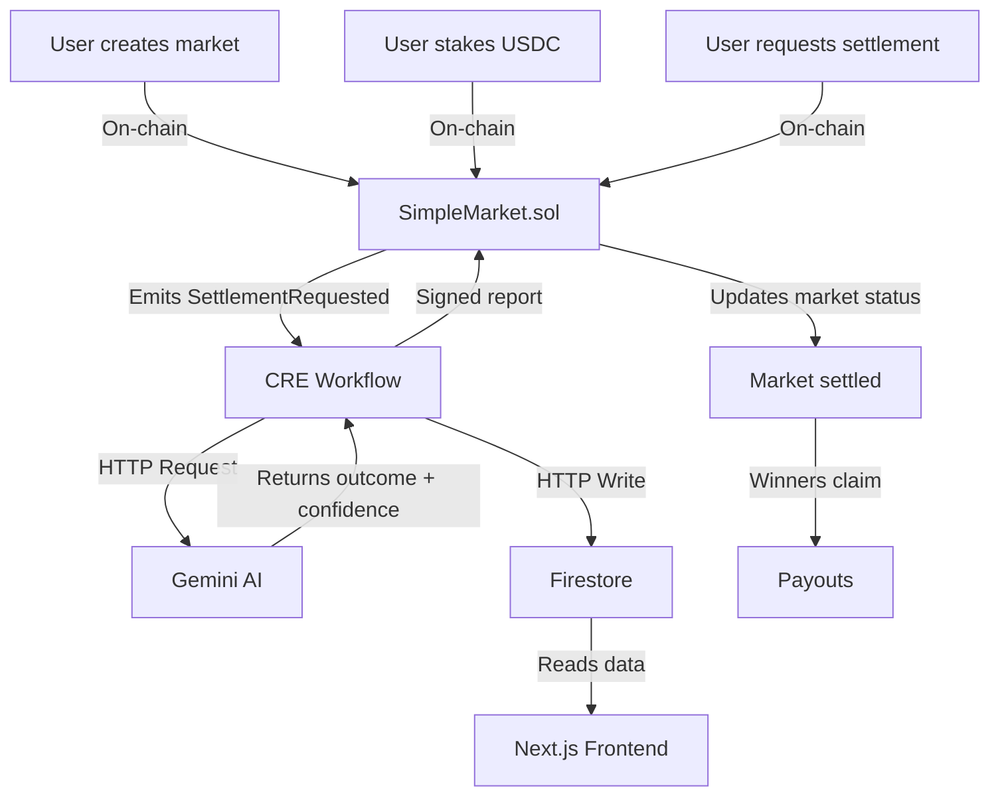
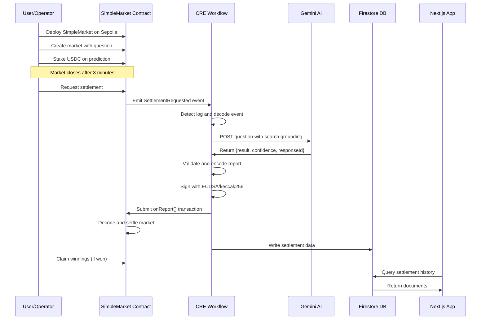

# Chainlink Runtime Environment (CRE) × Google Cloud – Prediction Market Demo

This repository demonstrates an end-to-end **automated, AI-powered prediction market** using the **Chainlink Runtime Environment (CRE)** integrated with Google's Gemini AI and Firebase.

## Table of Contents

- [What This Demo Does](#what-this-demo-does)
- [Repository Structure](#repository-structure)
  - [1. CRE Workflow Directory](#2-cre-workflow-directory)
  - [2. Contracts Directory](#1-contracts-directory)
  - [3. Frontend Directory](#3-frontend-directory)
- [How It Works](#how-it-works)
  - [Architecture Overview](#architecture-overview)
  - [Flow of Operations](#flow-of-operations)
- [Prerequisites](#prerequisites)
- [Quick Start](#quick-start)
  - [Option 1: Test CRE Workflow Only (Fastest)](#option-1-test-cre-workflow-only-fastest)
  - [Option 2: Full End-to-End Test](#option-2-full-end-to-end-test)
- [CRE Capabilities Demonstrated](#cre-capabilities-demonstrated)
- [Project Documentation](#project-documentation)
- [Observability Tips](#observability-tips)
  - [Monitoring CRE Workflow](#monitoring-cre-workflow)
  - [Checking On-Chain State](#checking-on-chain-state)
  - [Viewing on Etherscan](#viewing-on-etherscan)
- [Troubleshooting](#troubleshooting)
  - [Common Issues](#common-issues)
  - [Getting Help](#getting-help)
- [Security Considerations](#security-considerations)
- [Contributing](#contributing)
- [Acknowledgments](#acknowledgments)

## What This Demo Does

This project showcases how to build a fully automated prediction market system where:

1. Users create markets by asking binary (Yes/No) questions on-chain
2. Users stake ERC-20 tokens (USDC) to make predictions
3. After the market closes, anyone can request settlement
4. **CRE automatically triggers** when it detects the settlement request
5. **Gemini AI** determines the factual outcome using Google search grounding
6. **CRE submits** a cryptographically signed settlement report back on-chain
7. Settlement data is stored in **Firestore** for audit and display
8. Winners claim their proportional share of the total pool

**Key Technologies:**
- **Smart Contracts**: Solidity prediction market with CRE receiver integration
- **CRE**: Event-driven workflow orchestration
- **Gemini AI**: Automated fact-checking and outcome determination
- **Firebase/Firestore**: Audit trail and data persistence
- **Next.js Frontend**: User interface for viewing settlement history

## Repository Structure

This repository contains three main components:

```
.
├── contracts/              # Foundry project: SimpleMarket.sol and deployment scripts
├── cre-workflow/           # CRE TypeScript workflow for AI-powered settlement
├── frontend/               # Next.js app for viewing settlement data from Firestore
├── firebase-setup.md       # Firebase/Firestore configuration guide
└── README.md              # This file
```

### 1. CRE Workflow Directory

A Chainlink Runtime Environment project containing:
- TypeScript workflow orchestration
- Gemini AI integration
- EVM settlement logic
- Firestore database integration
- Configuration and secrets management

**[📖 Read the CRE Workflow README →](cre-workflow/README.md)**

### 2. Contracts Directory

A Foundry project containing:
- `SimpleMarket.sol` - Binary prediction market smart contract
- Comprehensive test suite
- Deployment and interaction scripts
- CRE receiver template integration

**[📖 Read the Contracts README →](contracts/README.md)**

### 3. Frontend Directory

A Next.js application that:
- Connects to Firestore database
- Displays recent market settlements
- Shows AI responses, confidence scores, and transaction hashes
- Provides a simple UI for monitoring the system

## How It Works

### Architecture Overview



### Flow of Operations



## Prerequisites

To run this demo, you'll need:

- [Git](https://git-scm.com/book/en/v2/Getting-Started-Installing-Git)
- [Node.js](https://nodejs.org/en/download) v20+
- [Bun](https://bun.sh/) (JavaScript runtime and package manager)
- [Foundry/Forge](https://github.com/foundry-rs/foundry) (`forge`, `cast`, `anvil`)
- [Chainlink Runtime Environment CLI](https://docs.chain.link/)
- [ETH Sepolia funds](https://faucets.chain.link/) for gas
- [Gemini API Key](https://aistudio.google.com/api-keys)
- [Firebase Project](./firebase-setup.md) with Firestore enabled
- [USDC on Sepolia](https://faucet.circle.com/) for market participation

## Quick Start

### Option 1: Test CRE Workflow Only (Fastest)

This repo ships with the address of a pre-deployed contract and transaction for immediate testing.

```bash
# 1. Install dependencies
cd cre-workflow/prediction-market-demo
bun install

# 2. Configure RPC endpoint
# Edit cre-workflow/project.yaml and set your Sepolia RPC URL for local-simulation


cd ..  # Back to cre-workflow directory

# 3. Set environment variables. Create .env file from example
cp .env.example .env

# Populate the .env file with your ETH private key, Gemini API key, Firebase API key, and Firebase project ID.

# 4. Run simulation
cre workflow simulate prediction-market-demo --target local-simulation

# 5. When prompted, use this pre-deployed transaction:
# Transaction hash: 0x24f3ccee54786d754ee07e4b8578ff6916c3cfca6e0f6fd71675aaad0039bc19
# Event index: 0
```

**Environment Variables** (`cre-workflow/.env`):
```bash
CRE_ETH_PRIVATE_KEY=0x...       # Private key with Sepolia ETH
CRE_TARGET=local-simulation
GEMINI_API_KEY_VAR=...          # From https://aistudio.google.com/api-keys
FIREBASE_API_KEY_VAR=...        # From Firebase console
FIREBASE_PROJECT_ID_VAR=...     # From Firebase console
```

See the [prerequisites](#prerequisites) section for information on obtaining your Gemini and Firebase keys.

### Option 2: Full End-to-End Test

#### Step 1: Deploy your own SimpleMarket 

Follow the detailed instructions in the [Contracts README](contracts/README.md) to:
- Install Foundry dependencies
- Configure your `.env` file
- Deploy the `SimpleMarket` contract
- Create a market with your own question
- Make a prediction
- Request settlement

**Note your deployed contract address and transaction hash from the settlement request** - you'll need it for the CRE workflow.

#### Step 2: Run CRE Workflow

Follow the detailed instructions in the [CRE Workflow README](cre-workflow/README.md) to:
- Install workflow dependencies
- Configure your environment variables and secrets
- Update `config.json` with your deployed contract address
- Run the CRE simulation with your transaction hash
- Optionally broadcast the settlement transaction

#### Step 3: Claim Rewards

Return to the contracts directory and follow the claim instructions in the [Contracts README](contracts/README.md) to claim your winnings if you made the correct prediction.

#### Step 4: Frontend Setup

Follow the detailed instructions in the [Frontend README](frontend/README.md) to:
- Install frontend dependencies
- Configure Firebase environment variables
- Run the development server
- View settlement history at `http://localhost:3000`

## CRE Capabilities Demonstrated

This demo showcases all three core CRE capabilities:

| Capability | Usage | Benefit |
|------------|-------|---------|
| **EVM Log Trigger** | Monitor for `SettlementRequested` events | Event-driven automation |
| **HTTP Capability** | Call Gemini AI and Firestore APIs | External data integration |
| **EVM Capability** | Submit signed settlement reports | Trustless on-chain writes |

**Additional Features:**
- **Secrets Management**: Secure API key storage
- **Consensus Aggregation**: Identical response requirement across nodes
- **Event Decoding**: ABI-based log parsing
- **Report Signing**: ECDSA signatures for authenticity

## Project Documentation

Each component has detailed documentation:

- **[CRE Workflow README](cre-workflow/README.md)** - Workflow logic, configuration, and troubleshooting
- **[Contracts README](contracts/README.md)** - Smart contract architecture, testing, and deployment
- **[Firebase Setup Guide](firebase-setup.md)** - Firestore configuration and security rules

## Observability Tips

### Monitoring CRE Workflow

Watch for these log messages:

```
[USER LOG] Event name: SettlementRequested
[USER LOG] Settlement request detected for Market Id: 0
[USER LOG] "Will Sweden win the 2025 Eurovision contest?"
[USER LOG] Successfully sent data to API. Status: 200
[USER LOG] Gemini Response for market: {"result":"YES","confidence":10000}
[USER LOG] Settling Market at contract: 0x...
[USER LOG] Write report transaction succeeded: 0x...
[USER LOG] Settlement tx hash: 0x...
[USER LOG] Firestore Document: projects/.../documents/demo/...
```

### Checking On-Chain State

```bash
# Get market details
cast call $MARKET "getMarket(uint256)" $MARKET_ID --rpc-url $RPC_URL

# Get your prediction
cast call $MARKET "getPrediction(uint256)" $MARKET_ID --rpc-url $RPC_URL

# Get evidence URI (Gemini response ID)
cast call $MARKET "getUri(uint256)" $MARKET_ID --rpc-url $RPC_URL
```

### Viewing on Etherscan

Find your contract on [Sepolia Etherscan](https://sepolia.etherscan.io/) to view:
- `SettlementRequested` events
- `SettlementResponse` events
- Market state changes
- Transaction history

## Troubleshooting

### Common Issues

**Issue**: CRE simulation fails to find network
- **Solution**: Check `chainSelectorName` in `config.json` matches CRE's supported chains

**Issue**: Gemini API returns 401 Unauthorized
- **Solution**: Verify `GEMINI_API_KEY_VAR` in `.env` and `secrets.yaml`

**Issue**: Market settlement fails with "MarketNotClosed"
- **Solution**: Wait for market close time (3 minutes after creation)

**Issue**: Claim fails with "IncorrectPrediction"
- **Solution**: Your prediction didn't match the winning outcome

**Issue**: Firestore write fails with permission denied
- **Solution**: Check security rules allow anonymous writes (see [firebase-setup.md](./firebase-setup.md))

### Getting Help

- **CRE Documentation**: [https://docs.chain.link/](https://docs.chain.link/)
- **Foundry Book**: [https://book.getfoundry.sh/](https://book.getfoundry.sh/)
- **Gemini API Docs**: [https://ai.google.dev/](https://ai.google.dev/)
- **Firebase Docs**: [https://firebase.google.com/docs](https://firebase.google.com/docs)

## Security Considerations

**⚠️ Important Notes:**

1. **This is a demo project** - Not audited or production-ready
2. **Never commit secrets** - Keep `.env` out of version control
3. **Test with small amounts** - Use testnet tokens only
4. **Verify AI responses** - Gemini responses may be incorrect or biased
5. **Monitor gas usage** - Settlement transactions consume gas from your account

## Contributing

Contributions are welcome! Please ensure:
- All tests pass (`forge test`, `cre workflow simulate`)
- Code is properly documented
- Follow existing code style

## Acknowledgments

- **Chainlink** for the CRE platform
- **Google** for Gemini AI and Firebase
- **OpenZeppelin** for secure smart contract libraries
- **Foundry** for the development framework
