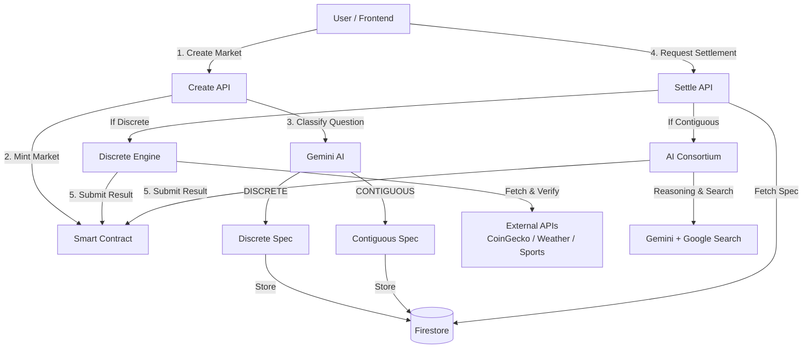

# OracleKit Prediction Market Demo

**OracleKit** is an AI-arbitrated prediction market platform that leverages Large Language Models (Gemini) to robustly settle markets using both discrete (API-based) and contiguous (reasoning-based) logic.

## 🚀 Key Features

### 1. Structured Natural Language Oracle Language (SNLOL)
Automatically classifies markets upon creation:
- **DISCRETE**: Examples "Is BTC > 90k?", "Did Lakers win?". Resolved deterministically via API.
- **CONTIGUOUS**: Examples "Will the election be contested?", "Is the CEO stepping down?". Resolved via AI reasoning & web search.

### 2. Dual-Engine Settlement
- **Primary**: Tries to resolve via **Discrete Resolution Engine** (fetch API -> extract value -> compare).
- **Secondary**: Falls back to **AI Consortium** (Gemini + search grounding) if discrete resolution fails.

### 3. Admin Console & Manual Settlement
Full suite for human oversight:
- **Dashboard**: Monitor open, pending, and inconclusive markets.
- **Manual Override**: Admin can intervene and settle any market (e.g., overriding an INCONCLUSIVE AI result).
- **Audit Trail**: All actions recorded on-chain and in Firestore.

### 4. Oracle Preview
"🔮 View" button on pending markets shows exactly how the market will be settled (API source, extraction path, condition) before the event occurs.

### 5. High-Concurrency Reliability
Implemented robust nonce management with retry logic to handle multiple simultaneous market creations on the blockchain.

---

## 🏗️ How it Works

The system architecture combines on-chain trust with off-chain AI reasoning:



### Future Improvements
1.  **Expanded Whitelist**: Add support for more discrete data sources (Flight status, GitHub commits, Shipping tracking).
2.  **Staking & Slashing**: Implement economic security for the AI Consortium validators.
3.  **Multi-Chain Support**: Deploy contracts to other EVM chains (Arbitrum, Base, Optimism).
4.  **Zk-Proof Integration**: Generate zero-knowledge proofs for the off-chain data fetching to prove the API response authenticity on-chain.

---

## 📸 Feature Walkthrough

### Admin Dashboard & Tools
````carousel

<!-- slide -->

<!-- slide -->

````

### Supported Data Sources (Discrete Engine)

| Category | API Source | Status |
|----------|------------|--------|
| CRYPTO_PRICE | CoinGecko | ✅ Working |
| FOREX_RATE | ExchangeRate-API | ✅ Working |
| WEATHER | wttr.in | ✅ Working |
| SPORTS_SCORE | TheSportsDB | ✅ Working |

---

## 🛠️ Tech Stack

- **Frontend**: Next.js 14, TailwindCSS, Retro Design System
- **Backend/API**: Next.js API Routes
- **Blockchain**: SimpleMarket.sol (Proprietary smart contract)
- **Database**: Firebase Firestore (for metadata & audit logs)
- **AI**: Google Gemini (via GoogleGenerativeAI SDK)
- **On-Chain Interaction**: ethers.js, viem

## 📦 Getting Started

### Prerequisites
- Node.js v18+
- Firebase Project
- Google Gemini API Key
- EVM-compatible Wallet & RPC URL

### Installation

1. Clone the repository:
   ```bash
   git clone <repo-url>
   cd cre-gcp-prediction-market-demo/frontend
   ```

2. Install dependencies:
   ```bash
   npm install
   ```

3. Configure Environment (`.env.local`):
   ```
   NEXT_PUBLIC_FIREBASE_API_KEY=...
   GEMINI_API_KEY=...
   CRE_ETH_PRIVATE_KEY=...
   NEXT_PUBLIC_RPC_URL=...
   NEXT_PUBLIC_MARKET_ADDRESS=...
   ```

4. Run the development server:
   ```bash
   npm run dev
   ```

5. Open [http://localhost:3000](http://localhost:3000) to see the app.
